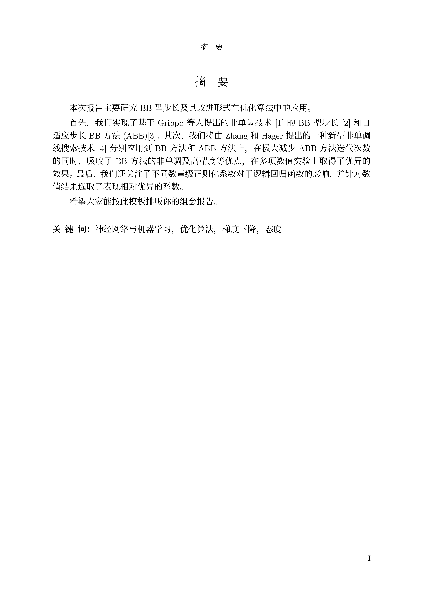
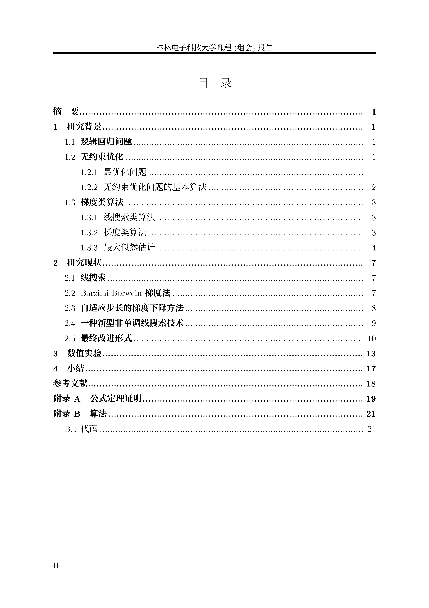

## GUETReport：桂林电子科技大学课程(组会)报告tex模板


### 欢迎使用桂林电子科技大学课程(组会)报告模板

本示例模板是应用桂林电子科技大学课程(组会)报告（非官方）LaTeX 文档类 GUETReport 的一个完整实现，参考自重庆大学组会报告。演示了排版中常用的例子，包括公式、表格、算法、参考文献等。
用户可以参考或者直接基于此示例文档撰写论文报告。

GUETReport 支持 XeLaTeX 引擎，字符编码仅支持 UTF-8。

## 获取模板
### 本地编译

本地编译可以直接 `clone` 或者[点击下载](https://github.com/wrm244/GUETReport/archive/refs/tags/v0.4.0.zip)仓库源代码编译main.tex即可。

```bash
git clone https://github.com/wrm244/GUETReport.git
```
模版更新频繁，且只维护最新版。如有问题，可以先尝试升级模版，而后根据“反馈问题”一栏进行反馈。
### Overleaf
可以直接使用我们已经上传好的Overleaf在线模板：
> 但是由于上传模板需要审核周期，更新频繁时候建议GitHub下载

[](https://www.overleaf.com/latex/templates/guetreport/qkvhzyszxscq)

点击 [链接](https://www.overleaf.com/latex/templates/guetreport/qkvhzyszxscq) 即可直接使用。

### 国内Texpage
可以直接使用我们已经上传好的Texpage在线模板：

[](https://texpage.com/template/ad704bfa-4d80-4f15-a842-e31ee307fff5)

点击 [链接](https://texpage.com/template/ad704bfa-4d80-4f15-a842-e31ee307fff5) 即可直接使用。

### Github Action 自动化集成

在仓库中提供CI/CD执行编译渲染PDF流程，你只要FORK这个仓库，然后本地编写或者直接通过github网页直接编写后push到你的github仓库，即可自动渲染,以下是ACTION配置代码：
```yml
name: Build LaTeX document
on:
    push:
      branches: [ main ]
jobs:
  build_latex:
    runs-on: ubuntu-latest
    steps:
      - name: Set up Git repository
        uses: actions/checkout@v3
      - name: Compile LaTeX document
        uses: xu-cheng/latex-action@v2
        with:
          root_file: main.tex
          latexmk_use_xelatex: true
      - name: Upload PDF file
        uses: actions/upload-artifact@v3
        with:
          name: PDF
          path: main.pdf
          
```

## 实例


### 封面


### 摘要




### 目录



## 软件许可证
桂林电子科技大学校徽校名图片（桂电标志.pdf 等）的版权归桂林电子科技大学校所有。

## 协议
[MIT](./LICENSE) © 河山 100%
