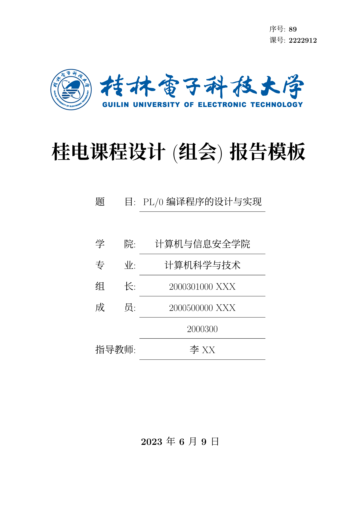

## GUETReport：桂林电子科技大学课程(组会)报告tex模板

### 欢迎使用桂林电子科技大学课程(组会)报告模板

本示例模板是应用桂林电子科技大学课程(组会)报告（非官方）LaTeX 文档类 GUETReport 的一个完整实现，参考自重庆大学组会报告。演示了排版中常用的例子，包括公式、表格、算法、参考文献等。
用户可以参考或者直接基于此示例文档撰写论文报告。

GUETReport 支持 XeLaTeX 引擎，字符编码仅支持 UTF-8。

## 获取模板

### 下载模版

普通用户可以直接 `clone` 或者点击下载仓库源代码编译main.tex即可。

```bash
git clone https://github.com/wrm244/GUETReport.git
```
模版更新频繁，且只维护最新版。如有问题，可以先尝试升级模版，而后根据“反馈问题”一栏进行反馈。

## 封面实例



## 协议
[MIT](./LICENSE) © 河山 100%